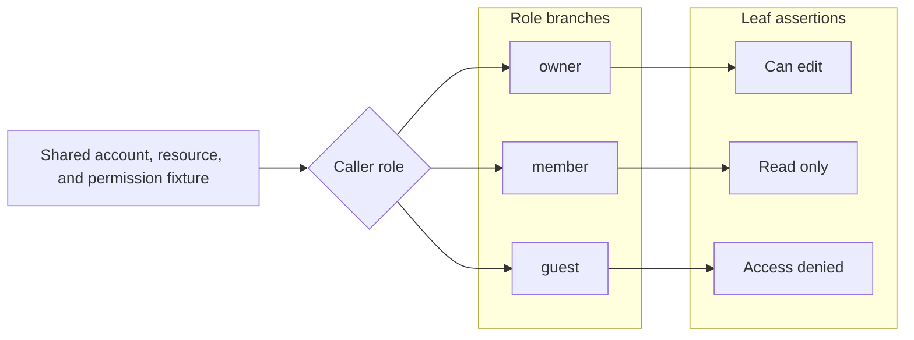

# 测试证据账本契约

本引用定义 `test-evidence-review` 的账本字段、源码角色、配置和 CLI 一致性约束。执行顺序、写入授权和语义准入由 [SKILL.md](../SKILL.md) 承接。

## 通用模型

默认账本路径是 `docs/testing/cases.md`，默认配置路径是 `.test-evidence.json`。账本保存稳定验证义务，源码标记保存测试文件的角色归属，CLI 校验结构、角色和发现结果。

三级或更深标题全部作为 case 解析，标题第一个 token 必须符合 `caseIdPattern`；普通章节只使用一级或二级标题。每个 case 必须声明 `Status: active | planned` 和 `Verification: automated | review | exempt`，合法组合只有：

1. `active + automated`：已有机械证明。
2. `planned + automated`：证明目标明确但尚未实现。
3. `active + review`：通过人工 CR 关注稳定风险。
4. `active + exempt`：测试发现结果已审计为误报。

review 和 exempt 不使用 planned。验证方式变化时保留稳定 case ID，并替换字段和源码映射。所有路径和 glob 使用工作区相对 POSIX 形式；`Scope:` 每个列表项只包含一个反引号包裹的路径或 glob。

## 账本格式

### 自动化 case

active automated：

````markdown
### WB-ACCESS-ROLE-001 Resource access follows role boundaries
Status: active
Verification: automated
Code: `src/access.test.ts`

Proves:
- Owner can edit.
- Member remains read-only.
- Guest is denied.


````

必须有且只有一个有效 `Code:`、一个包含至少一个证明点的 `Proves:` 列表和一个引用该 case 的 main；不声明 `Scope:`、`Risk:`、`Reason:` 或 `Review:`。

planned automated：

```markdown
### WB-CALC-FUTURE-001 Future behavior
Status: planned
Verification: automated

Proves:
- A future public behavior has an explicit proof target.
```

必须有且只有一个包含至少一个证明点的 `Proves:` 列表；不声明 `Code:`、`Scope:`、`Risk:`、`Reason:`、`Review:` 或源码标记。

### Proves 与多分支 case

一个 automated case 只声明一个 `Proves:` 列表，列表内包含一个或多个证明点。每项只写当前 case 语境下一个简短、直接的分支结果；背景、理由、共享数据和执行结构由 case 标题、行为 owner、`Code:` 与 Mermaid 承接。

同时满足以下条件时，优先把多个证明点保留在同一个 case：

1. 多个分支共享初始状态、基础数据、fixture、执行上下文或连续行为链路。
2. 分支沿共同主干在明确条件节点后分叉，每个叶子都对应可观察结果或当前白盒层拥有的不变量。
3. 拆分会复制准备工作、增加运行或状态同步成本，扩大审计负担，或者使共享底座分散后产生漂移。
4. 一个 main 能作为整组证据的规范入口；测试函数可以有多个，其他归属源码可以使用 derived。

分支条件或结果不同本身不是拆分理由。分支形成独立 owner、观察入口或行为链路，使用自己的 fixture、运行环境或维护周期，或者共享底座已经稳定集中且拆分能降低总维护与审计成本时，拆成独立 case。planned case 按预期共享基座和行为链路分组，不提前猜测 `Code:` 或 main 路径。

单一路径可以只使用 `Proves:` 列表。多分支 case 在列表后增加 fenced `mermaid` 块：连续链路、数据流和条件分叉使用 `flowchart LR`，层级与树状分支使用 `flowchart TD`；使用 `subgraph` 分组共享阶段或分支族，并按“共享基座 -> 分支条件 -> 处理阶段 -> 可观察结果”组织。每个叶子对应一个 `Proves:` 项，Mermaid 不替代证明点列表。

### 人工审查 case

```markdown
### RV-PROCESS-CLEANUP-001 Child process cleanup remains safe
Status: active
Verification: review

Scope:
- `src/process/**`

Risk:
- Abnormal termination may leave child processes or temporary files behind.

Reason:
- Reliable automation currently requires disproportionate operating-system fault injection.

Review:
- Confirm every failure path terminates the child process.
- Confirm temporary resources are released before returning the error.
```

`Scope:`、`Risk:`、`Reason:` 和 `Review:` 各有且只有一个非空列表，分别承接作用范围、稳定风险、自动化成本原因和检查动作；不声明 `Code:`、`Proves:` 或源码标记。

### 发现豁免 case

```markdown
### EX-PARSER-FIXTURE-001 Parser fixture is not project evidence
Status: active
Verification: exempt

Scope:
- `tests/fixtures/generated_project.py`

Reason:
- The detector recognizes test syntax inside a parser fixture that is read as data and never executed as a project test.
```

`Scope:` 和 `Reason:` 各有且只有一个非空列表；不声明 `Code:`、`Proves:`、`Risk:` 或 `Review:`。至少一个 exempt 标记引用该 case，豁免原因只保存在账本。

## 源码标记

统一语法是 `@test-evidence <main|derived|exempt> <CASE-ID>`：

1. `main` 引用 active automated case，是该 case 的唯一主入口；所在路径必须匹配 `Code:`。
2. `derived` 引用 active automated case，表示测试源码归属于已有主 case；它可以出现在多个文件，但不创建新 case。
3. `exempt` 引用 active exempt case；一个 case 可以映射多个误报文件。

统一约束：

1. 标记只包含角色和一个合法 case ID，不携带额外 token。
2. review 和 planned case 不得拥有源码标记；标记必须位于 CLI 实际发现为测试的源码文件中。
3. 同一文件可以关联多个 automated case，但同一 case 不能同时使用 main 和 derived；同一文件内的角色与 case ID 组合不重复。
4. exempt 按文件生效：一个文件只保留一个 exempt 标记，且不与 main 或 derived 混用。
5. CLI 识别常见的 `//`、`#`、`--`、`;`、块注释和 HTML 注释前缀。

发现器以文件为最小强制归属单元，不要求每个测试函数单独登记；函数级重复、无效或拆分判断由语义准入负责。

## 项目配置

```json
{
  "schemaVersion": 1,
  "catalogPath": "docs/testing/cases.md",
  "caseIdPattern": "^[A-Z][A-Z0-9]*(?:-[A-Z0-9]+){2,}-\\d{3}$",
  "languages": ["rust", "typescript", "python", "go"],
  "includeGlobs": ["src/**/*", "tests/**/*", "scripts/**/*"],
  "ignoreGlobs": ["**/build/**", "**/vendor/**"],
  "unregisteredTestFiles": "error"
}
```

`unregisteredTestFiles` 支持：

1. `ignore`：不检查未登记测试文件。
2. `warn`：报告但保持成功退出；这是默认值。
3. `error`：把未登记测试文件作为失败，适合 CI。

`includeGlobs` 省略或为空时，CLI 按启用语言的扩展名扫描。所有配置路径和 glob 必须保持工作区相对且不能包含 `..`。`ignoreGlobs` 只用于不进入项目审计范围的构建、依赖或 vendor 目录；项目拥有的发现误报使用 exempt。

## CLI 与发现边界

```text
node scripts/test-evidence.mjs check --root <workspace-root> [--config <relative-config-path>] [--json]
```

退出状态：`0` 表示没有结构或一致性错误，但仍可能包含 warn 报告；`1` 表示账本、角色、路径或严格未登记检查失败；`2` 表示参数错误。CLI 汇总各类 case、源码角色和未登记文件，要求 automated case 的 `Proves:` 至少包含一个列表项，并校验 `Scope:` 格式；它不执行测试、不判断证明点价值或 Mermaid 分组语义，也不代替 `Review:` 动作。

发现器识别 Rust 的 `#[test]` 和常见 namespaced test attribute，TypeScript/JavaScript 的 `test`、`it`、`describe`，Python 的 `test_*` 函数和 `Test*` 类，Go 的 `Test*`、`Benchmark*`、`Fuzz*`，常见 JUnit annotation，以及 xUnit、NUnit、MSTest attribute。

宏、别名、自定义框架和动态注册可能产生漏报或误报。先用 `warn` 建立基线，确认发现稳定后再使用 `error`；需要保留审计价值的误报登记为 exempt。
