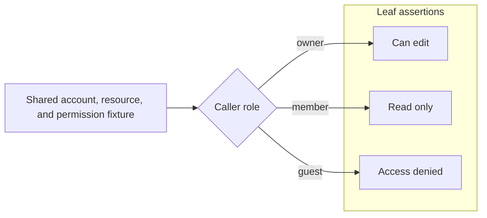

# 测试证据账本契约

本引用定义 `test-evidence-review` 的账本字段、测试入口角色、Git Scope、配置和 CLI 一致性约束。执行顺序、写入授权和语义评估由 [SKILL.md](../SKILL.md) 承接。

## 通用模型

默认账本路径是 `docs/testing/cases.md`，默认配置路径是 `.test-evidence.json`。账本保存当前验证义务和评估所需的稳定背景，源码标记把被发现的测试入口映射到 case，CLI 校验结构、入口角色、Git Scope、review trigger 和未登记入口。

case 标题固定使用：

```markdown
### Case WB-ACCESS-ROLE-001: Resource access follows role boundaries
```

`Case` 是三级标题中的保留前缀：fenced code block 外，以 `Case` 开头的三级标题必须逐字采用 `### Case <CASE-ID>: <title>`；不以 `Case` 开头的标题保留为普通 Markdown 结构。ID 是不包含空白或冒号的单个 token，并必须符合 `caseIdPattern`；标题不能为空。

每个 case 必须声明 `Status: active | planned` 和 `Verification: automated | review | exempt`，合法组合只有：

1. `active + automated`：已有自动化测试实现，并完成账本与测试入口映射。
2. `planned + automated`：契约和证明目标明确，但尚未建立测试入口映射。
3. `active + review`：通过人工 CR 关注稳定风险。
4. `active + exempt`：被发现的测试语法已审计为误报。

review 和 exempt 不使用 planned。验证方式变化时保留稳定 case ID，并替换字段和入口映射。所有路径和 glob 使用工作区相对 POSIX 形式。

## 账本格式

### Contract

active automated、planned automated 和 active review case 各有且只有一个非空 `Contract:` 列表。它用文字说明当前 case 的行为背景以及需要长期固定的规则、边界或不变量，为 `Proves:`、`Risk:` 和后续重新评估提供背景；它不记录决策人、文档 owner 或历史动机，也不以代码路径代替契约语义。

```markdown
Contract:
- A caller without the required role cannot modify the resource.
```

没有独立规范文档时，只有已经确认需要继续保持的当前行为才能写入 `Contract:`；实现和测试可以提供事实证据，但不能仅因代码当前如此就把偶然细节升级为契约。代码仍只作为定位信息。

### 自动化 case

active automated：

````markdown
### Case WB-ACCESS-ROLE-001: Resource access follows role boundaries
Status: active
Verification: automated
Code: `src/access.test.ts`

Contract:
- Resource mutation follows the caller role boundary.

Proves:
- Owner can edit.
- Member remains read-only.
- Guest is denied.


````

必须有且只有一个有效 `Code:`、一个非空 `Contract:`、一个包含至少一个证明点的 `Proves:` 列表和一个引用该 case 的 main 测试入口；不声明 `Scope:`、`Risk:`、`Reason:`、`Review:` 或 review 状态字段。

planned automated：

```markdown
### Case WB-CALC-FUTURE-001: Future behavior remains explicit
Status: planned
Verification: automated

Contract:
- The future public calculation rule has an explicit behavioral boundary.

Proves:
- The future result remains observable.
```

必须有且只有一个非空 `Contract:` 和 `Proves:` 列表；不声明 `Code:`、`Scope:`、`Risk:`、`Reason:`、`Review:`、review 状态字段或源码标记。

### Proves 与 case 分组

一个 automated case 只声明一个 `Proves:` 列表，列表内包含一个或多个证明点。每项只写当前契约语境下一个简短、直接且可独立判断的观察点，常见形式包括：

1. **分支证明点**：某个条件、等价类或失败出口产生的可观察结果或内部不变量。
2. **线性检查点**：同一条 happy path 或失败链路在某个顺序阶段已经成立的状态迁移、输出、副作用或清理不变量。

一个 case 有多个 `Proves:` 项不表示它必须存在分支，也不表示必须有多个测试入口。一条从准备、执行到结束始终沿同一路径推进的长链路，可以在多个阶段形成多个证明点；一个测试入口可以沿该链路完成多项断言，一个 main 与零个或多个 derived 入口也可以共同承接同一 case。入口 marker 只映射 case，不与 `Proves:` 项建立数量或位置上的一一对应。

例如，一条线性 happy path 可以同时固定：

```markdown
Proves:
- Accepted input creates one pending order.
- Payment confirmation moves the same order to paid.
- Fulfillment exposes a shipment reference for that order.
```

一条线性失败链路也可以同时固定错误返回、未提交业务变更和资源释放；只要这些观察点属于同一契约并依赖同一次连续执行，就不因“证明点不止一个”而拆成多个 case。

多个证明点共享初始状态、基础数据、fixture、执行上下文或行为主干，或者必须在同一连续链路中理解，且拆分会复制准备、丢失顺序关系、增加运行与同步成本或造成共享底座漂移时，优先保留在同一 case。证明点形成独立契约、观察入口、行为链路、运行环境或维护周期，或者拆分能降低总维护与审计成本时，建立独立 case。

短且顺序关系从 `Proves:` 已可直接理解的单一路径可以不画图。顺序、共享状态或阶段关系本身属于契约，或者仅看列表难以恢复链路时，增加 fenced `mermaid` `flowchart LR`，按“共享基座 -> 执行阶段 -> 可观察检查点 -> 最终结果”组织。多分支 case 使用 `flowchart LR` 或 `flowchart TD`，按“共享基座 -> 分支条件 -> 处理阶段 -> 可观察结果”组织，并可用 `subgraph` 分组。每个可观察检查点或分支叶子对应一个 `Proves:` 项；Mermaid 不替代证明点列表。

### 人工审查 case

```markdown
### Case RV-PROCESS-CLEANUP-001: Child process cleanup remains safe
Status: active
Verification: review

Contract:
- Every process exit path releases the child process and temporary resources.

Scope:
- `src/process/**`

Risk:
- Abnormal termination may leave child processes or temporary files behind.

Reason:
- Reliable automation currently requires disproportionate operating-system fault injection.

Review:
- Confirm every failure path terminates the child process.
- Confirm temporary resources are released before returning the error.

Review-Result: pass
Reviewed-At: 2026-07-20T10:30:00+08:00
Reviewed-Commit: 0123456789abcdef0123456789abcdef01234567
```

`Contract:`、`Scope:`、`Risk:`、`Reason:` 和 `Review:` 各有且只有一个非空列表，分别承接稳定契约、作用范围、风险、自动化成本原因和检查动作；不声明 `Code:`、`Proves:` 或源码标记。每个 `Review:` 项必须是只读、具体且能对命中范围作出 pass、findings 或 blocked 判断的检查动作，不能把修改代码或更新账本本身写成 CR 动作。

`Review-Result`、`Reviewed-At` 和 `Reviewed-Commit` 保存最近一次可持久化 CR 状态：

1. 三者必须同时声明或同时省略。
2. `Review-Result` 使用 `pass | findings | blocked`。
3. `Reviewed-At` 使用带时区的 ISO 8601 时间。
4. `Reviewed-Commit` 使用完整 40 或 64 位 Git commit hash，表示本次 CR 实际检查的已提交代码基线；它不是当前时间的近似标记。
5. `Status: active` 表示 review 义务当前有效；最近一次 CR 的结果由独立字段承接，不复用 `Status:`。

CR 直接检查已提交内容时可以写入三项状态。CR 检查未提交内容时先在当前任务报告结果；只有相同内容形成稳定 commit 且确认未在检查后变化，才能把该 commit 写为基线。状态未持久化前，脏工作区 trigger 不会因“刚刚看过”而机械消失。

### 发现豁免 case

```markdown
### Case EX-PARSER-FIXTURE-001: Parser fixture is not project evidence
Status: active
Verification: exempt

Scope:
- `tests/fixtures/generated_project.py`

Reason:
- The detector recognizes test syntax inside fixture data that is never executed as a project test.
```

`Scope:` 和 `Reason:` 各有且只有一个非空列表；不声明 `Contract:`、`Code:`、`Proves:`、`Risk:`、`Review:` 或 review 状态字段。至少一个 exempt 测试入口引用该 case；每个 exempt marker 的路径必须由 case `Scope:` 覆盖。

## 测试入口标记

统一语法是 `@test-evidence <main|derived|exempt> <CASE-ID>`：

1. `main` 引用 active automated case，是该 case 的唯一规范测试入口；所在路径必须匹配 `Code:`。
2. `derived` 引用 active automated case，表示另一个测试入口归属于同一 case；同一文件和不同文件都可以包含多个 derived。
3. `exempt` 引用 active exempt case，只豁免紧邻的发现误报入口。

每个被发现器识别的测试入口必须且只能绑定一个 marker。marker 放在入口之前；二者之间只能出现空行、注释、decorator 或测试 attribute。一个 case 可以包含多个测试入口，其中只有一个 main，其余使用 derived；账本仍按稳定契约和共享测试基座组织，不枚举测试函数。发现结果最终确认为非测试语法时，该入口使用 exempt，而不是把它继续称为可执行测试。

统一约束：

1. marker 只包含角色和一个合法 case ID，不携带额外 token。
2. review 和 planned case 不得拥有源码 marker。
3. 一个 marker 只能绑定一个入口；一个入口不能同时承担多个角色或 case。
4. 同一 automated case 在整个工作区只有一个 main；同一文件可以让不同入口分别使用 main、derived 或 exempt。
5. CLI 识别常见的 `//`、`#`、`--`、`;`、块注释和 HTML 注释前缀。

发现器以源码中识别出的测试入口作为最小强制归属单元。参数化测试按一个源码入口登记，不按运行时展开数量登记；函数级重复、价值和 case 分组继续由语义评估负责。

## Scope 与 Git review trigger

`Scope:` 每个列表项只包含一个反引号包裹的正向路径或 glob。CLI 使用 picomatch 的严格括号模式解析，拒绝负向 pattern、越界路径和无效 glob。

存在 review 或 exempt case 时，`--root` 必须是 Git worktree 根目录，保证账本路径、Scope 和 Git 输出使用同一相对基准。每个 Scope pattern 必须至少匹配一个 Git tracked 路径或非 ignored 的 untracked 路径；零匹配表示范围已经失效或写错，并作为结构错误报告。

对 active review case，CLI 汇总以下 trigger：

1. 当前未提交、已暂存或未跟踪路径命中 `Scope:`。
2. `Reviewed-Commit` 到当前 HEAD 的已提交路径命中 `Scope:`。
3. 尚未登记最近一次 CR。
4. 最近结果是 findings 或 blocked。
5. `Reviewed-Commit` 无法在当前 Git 历史中读取。

账本和配置文件是 review 状态载体，不因自身状态更新触发 Scope CR。CLI 只返回 trigger 和命中路径，不执行 `Review:`；调用 skill 的 agent 按任务范围执行动作并报告结果。上述五类 trigger 都由 `reviewTriggers` 决定 warning 或 error，不把“提交基线不可读取”额外升级为不受配置控制的结构错误。存在稳定提交基线时再更新最近 CR 字段。

`reviewMaxAgeDays` 只产生长期未复核提醒；没有代码变更时，时间阈值本身不把最近结果判定为失效。

## 标准测试入口清单

账本维护层只接受 `TestEntryInventory`，不读取源码、不选择文件，也不知道入口由正则、AST、测试框架清单或其他工具产生。清单固定使用 `schemaVersion: 1`，包含：

1. `entries`：入口在当前清单内唯一的 `id`、工作区相对 `path`、`language`、行列、offset 和产生它的 `detectorIds`；同一路径与 offset 只能有一个入口。
2. `markers`：源码 marker 的 case ID、角色、位置和 `targetEntryId`；无法绑定入口时目标为 `null`。
3. `diagnostics`：上游采集诊断，账本会原样纳入严格报告。

账本入口先按 [test-entry-inventory.schema.json](schemas/test-entry-inventory.schema.json) 收窄，再检查路径归一化、入口 ID 唯一性和 marker 引用完整性。复杂项目可以完全跳过内置正则采集器，只要自定义工具输出符合该 Schema 的清单即可接入账本维护层。

## 配置

### 账本配置

默认路径 `.test-evidence.json`，固定使用 `schemaVersion: 3`：

```json
{
  "schemaVersion": 3,
  "catalogPath": "docs/testing/cases.md",
  "caseIdPattern": "^[A-Z][A-Z0-9]*(?:-[A-Z0-9]+){2,}-\\d{3}$",
  "unregisteredTestEntries": "error",
  "reviewTriggers": "error",
  "reviewMaxAgeDays": 90
}
```

`unregisteredTestEntries` 支持 `ignore | warn | error`，默认 `warn`；`reviewTriggers` 支持 `warn | error`，默认 `warn`；`reviewMaxAgeDays` 是可选正整数。该配置不包含文件发现、语言或正则字段，精确结构以 [test-evidence-ledger-config.schema.json](schemas/test-evidence-ledger-config.schema.json) 为准。

### 正则采集配置

内置采集器默认读取可选的 `.test-entry-regex.json`。没有定制需求时不创建该文件；缺省配置会检查 Rust、TypeScript、JavaScript、Python、Go、Java 和 C# 的常见测试入口，并排除常见依赖与构建目录。

需要限制文件或增加项目模式时使用 `schemaVersion: 1`：

```json
{
  "schemaVersion": 1,
  "builtinDetectors": ["typescript", "python"],
  "includeGlobs": ["src/**/*", "tests/**/*"],
  "excludeGlobs": ["**/fixtures/**"],
  "patterns": [
    {
      "id": "project:scenario",
      "language": "scenario",
      "includeGlobs": ["**/*.spec"],
      "excludeGlobs": [],
      "pattern": "^CASE\\s+",
      "flags": "mu"
    }
  ]
}
```

全局 `includeGlobs` 限定候选文件；`excludeGlobs` 追加到内置的依赖、构建和隐藏目录排除项；每个自定义 detector 再用自己的 include/exclude 决定是否运行。`pattern` 是 JavaScript 正则源码，采集器自动增加全局匹配标志；`flags` 只接受不重复的 `i | m | s | u`。正则通过捕获组定位入口时用正整数 `offsetGroup` 指向目标组。自定义 ID 不得使用保留的 `builtin:` 前缀。所有 glob 必须是工作区相对 POSIX 形式且不能越界，精确结构以 [regex-collector-config.schema.json](schemas/regex-collector-config.schema.json) 为准。

内置 detector 识别 Rust `#[test]` 与常见 namespaced test attribute、TypeScript/JavaScript `test` 和 `it` 的注册调用及常见 modifier、Python `test_*` 函数或方法、Go `Test*`/`Benchmark*`/`Fuzz*` 函数、常见 JUnit test annotation，以及 xUnit、NUnit 和 MSTest test attribute。容器或控制调用如 `describe`、`test.describe`、hook 和 `test.step` 不作为内置入口。

正则采集器按全文匹配，不猜测注释、字符串、fixture 或生成代码是否可执行。内置规则只提供常见入口基线，可能产生漏报或误报；项目可以调整文件范围或正则，要求语法级精度时应使用 AST 等自定义采集器输出标准清单。仅当一个已收集入口经过审计仍需要长期保留为非测试结果时，才使用 entry-level exempt；不要让账本维护层反向承担发现规则。

## CLI 与导入接口

正则采集层与账本层分别调用：

```text
node scripts/test-entry-regex.mjs --root <workspace-root> [--config <collector-config>] > inventory.json
node scripts/test-evidence-ledger.mjs check --inventory inventory.json --root <workspace-root> [--config <ledger-config>] [--json]
node scripts/test-evidence-ledger.mjs list --inventory inventory.json --root <workspace-root> [--json]
node scripts/test-evidence-ledger.mjs show <case-id> --inventory inventory.json --root <workspace-root> [--json]
```

`--inventory -` 从 stdin 读取。`test-entry-regex.mjs` 只输出清单；`test-evidence-ledger.mjs` 不导入采集器。标准清单固定使用 v1，账本配置固定使用 v3，可选正则采集配置固定使用 v1，各入口按对应 Schema 严格校验。

`check` 是严格校验；`list` 和 `show` 是恢复查询。查询在配置、清单和账本可读取时返回仍可恢复的 case、入口映射和 review trigger，并把严格诊断复制为 `blocking: false` 的非阻断诊断；原始 `severity` 不变。配置、清单或账本不可读取，或者 `show` 目标缺失或不唯一时查询失败。

退出状态：`0` 表示严格检查没有 blocking diagnostic，或查询已返回可恢复结果；`1` 表示存在阻断诊断或查询缺少必要输入/唯一目标；`2` 表示参数错误。

指定 `--json` 时，配置、清单文件或 JSON、账本和查询目标等可预期输入失败仍向 stdout 写出当前命令对应 Schema 的结构化结果，并保持 stderr 为空；参数语法错误继续由 CLI 帮助和退出状态 `2` 承接。

严格报告固定使用 `schemaVersion: 2`。每项 diagnostic 至少包含 `blocking`、稳定 `code`、`category`、`severity` 和 `message`，按可用信息增加 `path`、`line`、`column`、`caseId` 或 `detectorId`。调用方使用 `diagnostics[].blocking` 判断命令完成状态，按 `severity` 区分问题级别；报告、inspection 和 query 的精确结构分别由 `references/schemas/` 中对应 JSON Schema 定义。

两个 MJS 都可安全导入且不会执行 CLI：

1. `test-entry-regex.mjs` 导出 `collectRegexTestEntries(options)`、采集相关 Valibot Schema 和 `runRegexCollectorCli(argv)`。
2. `test-evidence-ledger.mjs` 导出 `parseTestEntryInventory(value)`、`inspectTestEvidenceLedger(options)`、`validateTestEvidenceLedger(options)`、账本相关 Valibot Schema 和 `runTestEvidenceLedgerCli(argv)`。

相邻 `.d.mts` 提供函数声明；数据类型由同一 Valibot Schema 先生成 JSON Schema，再生成 `*.types.d.mts`，不维护反向生成 Schema 的第二套类型定义。

旧版组合配置、命令、导入和机器报告的替换方式见 [upgrade-from-v2.md](upgrade-from-v2.md)。当前模块只接受本契约定义的版本，不执行运行时迁移。

CLI 不执行测试、不判断 `Contract:` 或 `Proves:` 的价值、不判断 Mermaid 分组语义，也不代替 `Review:` 动作。
